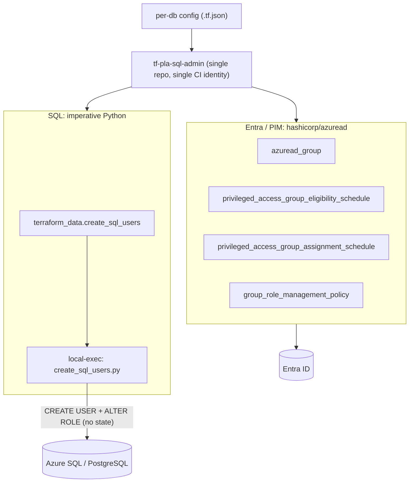
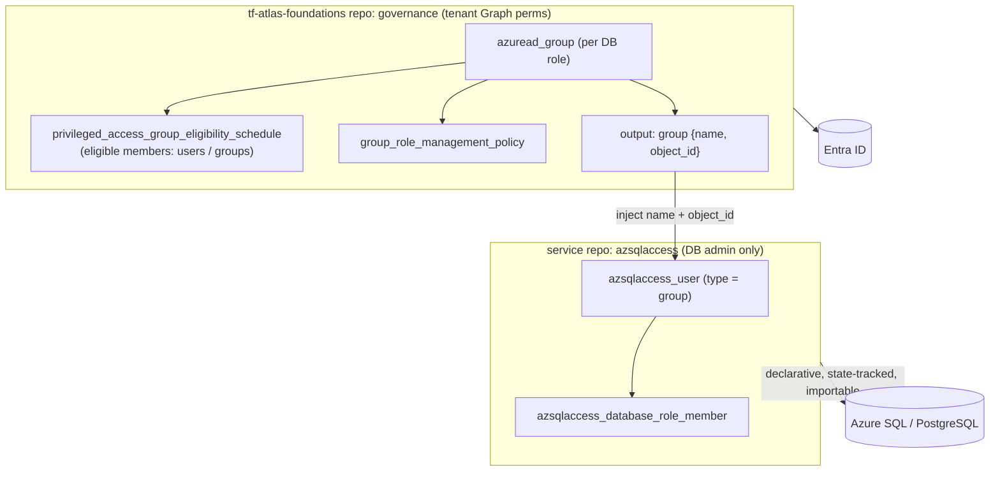

# Migrating database access off `tf-pla-sql-admin`

## Motivation

Database access today is managed by a single repo that couples two very
different concerns: **Entra ID group + PIM governance** (declarative, via
`hashicorp/azuread`) and **the actual SQL grants** (imperative, via a Python
script run through `terraform_data` + `local-exec`). The SQL half has no native
Terraform (IaC) support: no state, no drift detection, no import. The one CI
identity also holds both directory permissions and database access.

We now have a dedicated Terraform provider, **[`azsqlaccess`](https://github.com/MewsSystems/terraform-provider-azsqlaccess)**, that manages
contained database users and role memberships **declaratively** (state-tracked,
idempotent, importable) on Azure SQL and PostgreSQL Flexible Server. This lets
us split the concerns cleanly and shrink each identity's privilege:

- **Entra ID groups + PIM eligibility** move to the central **`tf-atlas-foundations`** repo (the governance layer that already holds the privileged Graph permissions).
- **The database users + role memberships** are managed by each **service** repo with `azsqlaccess`, using **database-admin rights only, zero directory permissions**.

The contract between them is just the group identity: `tf-atlas-foundations` outputs each
group's `{name, object_id}`; the service consumes those two values.

## Today: everything in `tf-pla-sql-admin`

| Layer | Tooling | Resources / actions | State & privilege |
| --- | --- | --- | --- |
| Entra / PIM | `hashicorp/azuread` (declarative) | `azuread_group`, `azuread_group_member`, `azuread_privileged_access_group_eligibility_schedule` / `_assignment_schedule`, `azuread_group_role_management_policy` | Terraform-managed; CI identity needs directory (Graph) permissions |
| SQL | Python via `terraform_data` + `local-exec` (imperative) | `CREATE USER ... FROM EXTERNAL PROVIDER`, `ALTER ROLE ... ADD MEMBER` | **No state, no drift detection, no import**; same CI identity also reaches every database |

One repo, one CI identity, both the directory **control plane** and the database
**data plane**.

### What gets created: role tiers

For each database, the current setup creates **one Entra security group per role
tier**, each with a PIM eligibility assignment for the teams allowed to activate
into it:

| Tier | DB role(s) granted: MSSQL / PostgreSQL |
| --- | --- |
| Read | `db_datareader` / `pg_read_all_data` |
| Write | `db_datawriter` / `pg_read_all_data` + `pg_write_all_data` |
| Schema (DDL) | `db_ddladmin` / n/a (MSSQL only) |
| Owner | `db_owner` / n/a (MSSQL only; PostgreSQL has no owner tier) |

Plus **team-managed groups**: deputized-owner groups whose membership is managed
by team leads, which then hold PIM eligibility *into* the tiers above (e.g. owner
on service DBs, write on the monolith).

The new approach preserves these exact tiers: the groups + eligibility are
created in `tf-atlas-foundations`, and the matching DB role grant
(`azsqlaccess_database_role_member`) is applied wherever the DB grants run.

## New approach: split across `tf-atlas-foundations` + service

| Concern | Owner | Tooling | Resources | Permissions it needs |
| --- | --- | --- | --- | --- |
| AD groups + PIM eligibility (assign users/groups as eligible members) | **`tf-atlas-foundations`** | `hashicorp/azuread` | `azuread_group`, `azuread_privileged_access_group_eligibility_schedule`, `azuread_group_role_management_policy` | `Group.ReadWrite.All`, `PrivilegedAccess.ReadWrite.AzureADGroup`, `RoleManagementPolicy.ReadWrite.AzureADGroup` (Graph, tenant) |
| DB users + role memberships | **service repo** | `MewsSystems/azsqlaccess` | `azsqlaccess_user` (`type = "group"`), `azsqlaccess_database_role_member` | **Database admin only** (server Entra admin / `db_owner`). **No Graph permissions.** |

Because `tf-atlas-foundations` injects the group `object_id`, the provider issues
`CREATE USER ... WITH OBJECT_ID`, so the SQL server does **not** need Directory
Readers either. The service side is purely a data-plane operation.

## How it's done now



## How it would be done



## Implementation sketch

Illustrative example. Replace the placeholder group names, servers, and
databases with your own.

### `tf-atlas-foundations`: groups + PIM eligibility, output `{name, object_id}`

```hcl
# One Entra group + PIM eligibility per DB role tier.
locals {
  db_role_tiers = ["db_datareader", "db_datawriter", "db_ddladmin", "db_owner"]
}

resource "azuread_group" "db" {
  for_each         = toset(local.db_role_tiers)
  display_name     = "${var.group_prefix}.${each.key}"
  security_enabled = true
}

# Eligible assignees activate JIT into the group: no standing membership.
resource "azuread_privileged_access_group_eligibility_schedule" "db" {
  for_each             = azuread_group.db
  group_id             = each.value.object_id
  principal_id         = var.assignee_group_object_id
  access_id            = "member"
  permanent_assignment = true
}

# The contract handed to the service repo.
output "db_groups" {
  value = {
    for tier, g in azuread_group.db :
    tier => { name = g.display_name, object_id = g.object_id }
  }
}
```

### Service repo: consume the injection, grant in the database

```hcl
provider "azsqlaccess" {
  engine = "mssql" # uses Managed Identity / Workload Identity by default
}

# Azure SQL building block: provisions the server + database and exposes them
# as outputs. The azsqlaccess resources consume those outputs (no hardcoding).
module "sql" {
  source = "<your-mssql-building-block>"

  name = "mydb"
  # ...other building-block inputs (sku, location, ...)
}

# {name, object_id} per role tier, injected from tf-atlas-foundations
# (terraform_remote_state output, tfvars, or Port).
variable "db_groups" {
  type = map(object({ name = string, object_id = string }))
}

resource "azsqlaccess_user" "db" {
  for_each  = var.db_groups
  server    = module.sql.server_fqdn   # building-block output
  database  = module.sql.database_name # building-block output
  type      = "group"
  name      = each.value.name
  object_id = each.value.object_id # avoids Directory Readers on the SQL server
}

resource "azsqlaccess_database_role_member" "db" {
  for_each = azsqlaccess_user.db
  server   = each.value.server
  database = each.value.database
  role     = each.key # db_datareader, db_datawriter, db_ddladmin, db_owner
  member   = each.value.name
}
```

The service identity needs **only** database-admin access: no Graph
permissions, and (because `object_id` is supplied) no Directory Readers on the
SQL server.

## Trade-offs: current vs proposed

### Current: everything in `tf-pla-sql-admin`

One repo manages the AD groups + PIM (via `azuread`) and the database grants
(via the imperative Python script).

**Pros**

- _Familiarity:_ it's what runs today, no migration needed.
- _Single place:_ groups, PIM, and DB grants all live in one repo and pipeline.

**Cons**

- _Security:_ one CI identity holds **both** directory (Graph) permissions **and** reaches **every** database. It spans the control plane and every data plane, a large blast radius.
- _Maintainability:_ the SQL layer is an imperative Python script with **no state, no drift detection, no import**.
- _Ownership:_ a central bottleneck: every DB-access change funnels through one repo/team.
- _Operational:_ the repo must keep connectivity and credentials to every database.
- _Sprawl:_ yet another repo and CI pipeline to maintain and watch: a separate source of truth and centralized settings place, with a new entry to add for every onboarded service, disconnected from where the services and databases actually live.

### Proposed: split across `tf-atlas-foundations` + service repos

`tf-atlas-foundations` owns the AD groups + PIM eligibility; each service repo
runs `azsqlaccess` against its own database, consuming the injected
`{name, object_id}`.

**Pros**

- _Security:_ the per-service identity is **database-admin only, with zero directory permissions**, and `tf-atlas-foundations` stays **control-plane only** and never reaches a database. Neither identity spans both planes.
- _Maintainability:_ database **users and role assignments become first-class IaC** (declarative, state-tracked, drift-detected, and importable), replacing the imperative, stateless Python script.
- _Provisioning-ready:_ the Entra groups come ready-made out of `tf-atlas-foundations` provisioning, with no separate repo entry to add per service.
- _Ownership:_ each team owns and self-services its own database access, on its own cadence.

**Cons**

- _Operational:_ more moving parts: a `{name, object_id}` contract to keep in sync, and each service repo must add the provider and have database-admin connectivity to its server.
- _Centralized membership:_ who can access a database (the group's eligible members) still lives in `tf-atlas-foundations`, so adding a new reader or writer is a PR **there**, not in the service repo. Teams need to know that, or come back to foundations to raise it. This is because Entra can't grant group-membership management at a fine-grained (per-database) scope (the finest supported is an administrative unit), so keeping eligibility least-privilege means keeping it central rather than handing each service MI broad directory permissions.
- _Migration:_ a one-time cut-over that splits the current repo in two. The AD groups + PIM eligibility move to `tf-atlas-foundations`, and the database grants move to each service repo on the new provider (importing existing principals per database).

### Proposal

Move to the **proposed split**: it removes the imperative script, makes DB
access declarative and team-owned, and, most importantly, stops any single
identity from spanning both the directory control plane and the database data
plane. The cost is per-service wiring and a one-time migration.
