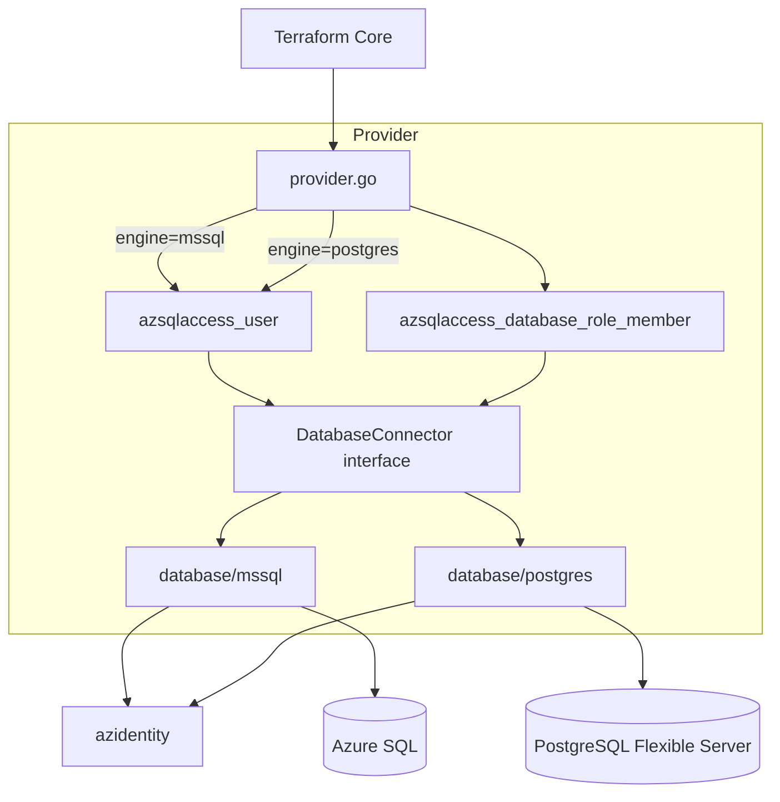

# terraform-provider-azsqlaccess

Terraform provider for managing **contained database users** and **role memberships** via Entra ID (Azure AD) on Azure SQL and Azure PostgreSQL Flexible Server. SQL Server auth is not supported — Entra ID only.

## Architecture



The engine is selected **once** in `provider.Configure()` and injected into all resources. Resources only ever import `internal/database` — never `internal/database/mssql` or `internal/database/postgres`. The SQL layer is invisible to the Terraform layer.

### How each engine implements the interface

| Operation | MSSQL | PostgreSQL |
|---|---|---|
| `CreateUser` (type=user) | `CREATE USER [upn] FROM EXTERNAL PROVIDER` | `pgaadauth_create_principal(name, false, false)` |
| `CreateUser` (type=group) | `CREATE USER [name] FROM EXTERNAL PROVIDER WITH OBJECT_ID = 'oid'` | `pgaadauth_create_principal_with_oid(name, oid, 'group', false, false)` |
| `CreateUser` (type=service_principal) | `CREATE USER [name] FROM EXTERNAL PROVIDER WITH OBJECT_ID = 'oid'` | `pgaadauth_create_principal_with_oid(name, oid, 'service', false, false)` |
| `GetUser` | `SELECT ... FROM sys.database_principals WHERE name = @name` | `SELECT oid::bigint FROM pg_roles WHERE rolname = $1` |
| `UpdateUser` | `ALTER USER [name] WITH DEFAULT_SCHEMA = [schema]` | `ALTER ROLE "name" SET search_path TO "schema"` |
| `DeleteUser` | `DROP USER IF EXISTS [name]` | `DROP ROLE IF EXISTS "name"` |
| `CreateRoleMember` | `ALTER ROLE [role] ADD MEMBER [member]` | `GRANT "role" TO "member"` |
| `DeleteRoleMember` | `ALTER ROLE [role] DROP MEMBER [member]` | `REVOKE "role" FROM "member"` |
| `GetRoleMember` | `SELECT ... FROM sys.database_role_members` | `SELECT ... FROM pg_auth_members` |

---

## Provider configuration

```hcl
terraform {
  required_providers {
    azsqlaccess = {
      source = "MewsSystems/azsqlaccess"
    }
  }
}

# MSSQL provider instance
provider "azsqlaccess" {
  engine = "mssql"

  # Optional. See "Authentication" below for the full credential precedence.
  # Omit entirely for `az login` / Managed Identity / Workload Identity (ambient chain).
  tenant_id     = "..."   # or AZURE_TENANT_ID / ARM_TENANT_ID env var
  client_id     = "..."   # or AZURE_CLIENT_ID / ARM_CLIENT_ID env var
  client_secret = "..."   # or AZURE_CLIENT_SECRET / ARM_CLIENT_SECRET env var
}

# PostgreSQL provider instance (alias required when using both engines)
provider "azsqlaccess" {
  alias  = "postgres"
  engine = "postgres"

  # Optional, PostgreSQL only. Required when the caller is an administrator only
  # through Entra group membership — see "Connecting as an Entra group" below.
  # login_username = "db.reader"
}
```

| Attribute | Required | Description |
|---|---|---|
| `engine` | yes | `"mssql"` or `"postgres"` |
| `tenant_id` | no | Entra tenant ID. Falls back to `AZURE_TENANT_ID` then `ARM_TENANT_ID` |
| `client_id` | no | Service principal client ID. Falls back to `AZURE_CLIENT_ID` then `ARM_CLIENT_ID` |
| `client_secret` | no | Service principal secret. Falls back to `AZURE_CLIENT_SECRET` then `ARM_CLIENT_SECRET`. Sensitive |
| `login_username` | no | PostgreSQL role to connect as, overriding the token-derived identity. Falls back to `AZSQLACCESS_LOGIN_USERNAME`. `engine = "postgres"` only — an error on `mssql` |

---

## Resources

### `azsqlaccess_user`

Creates a contained Entra identity inside a database. The `type` attribute determines how the principal is resolved on both engines.

#### Principal types and name format

| `type` | `name` | `object_id` | Notes |
|---|---|---|---|
| `"user"` | UPN — `"juan.perez@milanesa.com"` | must **not** be set | UPNs are globally unique in Entra |
| `"group"` | Display name — `"db.reader"` | **required** | Multiple groups can share a display name |
| `"service_principal"` | Display name — `"myapp-identity"` | **required** | Covers both app registrations and managed identities |

The `object_id` is the **Object (principal) ID** shown in the Azure portal — the same value for both engines.

#### Schema

| Attribute | Type | Description |
|---|---|---|
| `server` | string, required | Fully-qualified hostname, e.g. `myserver.database.windows.net` |
| `database` | string, required | Target database name |
| `type` | string, required | `"user"`, `"group"`, or `"service_principal"` |
| `name` | string, required | UPN (user) or display name (group, service_principal) |
| `object_id` | string, required for group/sp | Entra Object (principal) ID UUID. Forbidden for type=user |
| `default_schema` | string, optional/computed | Default schema. MSSQL: `DEFAULT_SCHEMA` (default `dbo`). PostgreSQL: `search_path` (default `public`) |
| `principal_id` | int64, computed | `sys.database_principals.principal_id` (MSSQL) or `pg_roles.oid` (PostgreSQL) |
| `id` | string, computed | See import format below |

#### Import

```bash
# type = user
terraform import azsqlaccess_user.example \
  "myserver.database.windows.net/mydb/user/juan.perez@milanesa.com"

# type = group  (object_id is part of the ID — required field, taken from config/import, not read back)
terraform import azsqlaccess_user.example \
  "myserver.database.windows.net/mydb/group/db.reader/00000000-0000-0000-0000-000000000000"

# type = service_principal
terraform import azsqlaccess_user.example \
  "myserver.database.windows.net/mydb/service_principal/myapp-identity/00000000-0000-0000-0000-000000000000"
```

---

### `azsqlaccess_database_role_member`

Grants one database role to one member. No Update — all attributes force replacement.

| Attribute | Type | Description |
|---|---|---|
| `server` | string, required | Fully-qualified hostname |
| `database` | string, required | Target database name |
| `role` | string, required | Database role name, e.g. `db_datareader` or `pg_read_all_data` |
| `member` | string, required | Principal name — use `azsqlaccess_user.<name>.name` to declare the dependency |
| `id` | string, computed | `server/database/role/member` |

#### Import

```bash
terraform import azsqlaccess_database_role_member.example \
  "myserver.database.windows.net/mydb/db_datareader/juan.perez@milanesa.com"
```

---

## Full examples

### MSSQL

```hcl
provider "azsqlaccess" {
  engine = "mssql"
}

resource "azsqlaccess_user" "mssql_user" {
  server   = "myserver.database.windows.net"
  database = "mydb"
  type     = "user"
  name     = "juan.perez@milanesa.com"
}

resource "azsqlaccess_user" "mssql_group" {
  server    = "myserver.database.windows.net"
  database  = "mydb"
  type      = "group"
  name      = "db.reader"
  object_id = "00000000-0000-0000-0000-000000000000"
}

resource "azsqlaccess_user" "mssql_managed_identity" {
  server    = "myserver.database.windows.net"
  database  = "mydb"
  type      = "service_principal"
  name      = "myapp-identity"
  object_id = "00000000-0000-0000-0000-000000000000"
}

resource "azsqlaccess_database_role_member" "mssql_user_reader" {
  server   = "myserver.database.windows.net"
  database = "mydb"
  role     = "db_datareader"
  member   = azsqlaccess_user.mssql_user.name
}

resource "azsqlaccess_database_role_member" "mssql_group_reader" {
  server   = "myserver.database.windows.net"
  database = "mydb"
  role     = "db_datareader"
  member   = azsqlaccess_user.mssql_group.name
}

resource "azsqlaccess_database_role_member" "mssql_mi_reader" {
  server   = "myserver.database.windows.net"
  database = "mydb"
  role     = "db_datareader"
  member   = azsqlaccess_user.mssql_managed_identity.name
}
```

### PostgreSQL Flexible Server

```hcl
provider "azsqlaccess" {
  alias  = "postgres"
  engine = "postgres"
}

resource "azsqlaccess_user" "postgres_user" {
  provider = azsqlaccess.postgres
  server   = "myserver.postgres.database.azure.com"
  database = "mydb"
  type     = "user"
  name     = "juan.perez@milanesa.com"
}

resource "azsqlaccess_user" "postgres_group" {
  provider  = azsqlaccess.postgres
  server    = "myserver.postgres.database.azure.com"
  database  = "mydb"
  type      = "group"
  name      = "db.reader"
  object_id = "00000000-0000-0000-0000-000000000000"
}

resource "azsqlaccess_user" "postgres_managed_identity" {
  provider  = azsqlaccess.postgres
  server    = "myserver.postgres.database.azure.com"
  database  = "mydb"
  type      = "service_principal"
  name      = "myapp-identity"
  object_id = "00000000-0000-0000-0000-000000000000"
}

resource "azsqlaccess_database_role_member" "postgres_user_reader" {
  provider = azsqlaccess.postgres
  server   = "myserver.postgres.database.azure.com"
  database = "mydb"
  role     = "pg_read_all_data"
  member   = azsqlaccess_user.postgres_user.name
}

resource "azsqlaccess_database_role_member" "postgres_group_reader" {
  provider = azsqlaccess.postgres
  server   = "myserver.postgres.database.azure.com"
  database = "mydb"
  role     = "pg_read_all_data"
  member   = azsqlaccess_user.postgres_group.name
}

resource "azsqlaccess_database_role_member" "postgres_mi_reader" {
  provider = azsqlaccess.postgres
  server   = "myserver.postgres.database.azure.com"
  database = "mydb"
  role     = "pg_read_all_data"
  member   = azsqlaccess_user.postgres_managed_identity.name
}
```

---

## Authentication

The provider resolves an Entra credential once at startup and shares it across both engines. The precedence mirrors `azurerm`/`azuread`/`azapi` so pipelines wired for those providers work without changes:

1. **Service principal** — `tenant_id` + `client_id` + `client_secret` all set (HCL or `AZURE_*`/`ARM_*` env vars).
2. **GitHub Actions OIDC** — `ARM_USE_OIDC=true`. The provider performs the federation exchange against the runner-injected `ACTIONS_ID_TOKEN_REQUEST_URL`/`_TOKEN` automatically — no extra workflow step required.
3. **Explicit OIDC token (non-GitHub CI)** — `ARM_USE_OIDC=true` plus `ARM_OIDC_TOKEN` (raw JWT) or `ARM_OIDC_TOKEN_FILE_PATH` (path to a file containing the JWT).
4. **Ambient chain** — fallback. An explicit `ChainedTokenCredential` of Azure CLI → Workload Identity → Managed Identity (`az login`). Interactive browser / IDE / dev-CLI credentials are deliberately excluded.

### Service principal (client secret)

```bash
export AZURE_TENANT_ID="..."        # or ARM_TENANT_ID
export AZURE_CLIENT_ID="..."        # or ARM_CLIENT_ID
export AZURE_CLIENT_SECRET="..."    # or ARM_CLIENT_SECRET
```

### GitHub Actions OIDC

Configure a federated credential on the SP for `repo:<owner>/<repo>:ref:refs/heads/<branch>`, then in the workflow:

```yaml
permissions:
  id-token: write
  contents: read
env:
  ARM_USE_OIDC:        'true'
  ARM_TENANT_ID:       ${{ secrets.AZURE_TENANT_ID }}
  ARM_CLIENT_ID:       ${{ secrets.AZURE_CLIENT_ID }}
  ARM_SUBSCRIPTION_ID: ${{ secrets.AZURE_SUBSCRIPTION_ID }}
```

### Local dev

```bash
az login
az account set --subscription "..."
```

### Engine-specific token plumbing

Both engines now share the same `azcore.TokenCredential`. MSSQL uses go-mssqldb's `NewAccessTokenConnector` to inject a token into each new connection (audience `https://database.windows.net/.default`). PostgreSQL acquires a token (audience `https://ossrdbms-aad.database.windows.net/.default`) and writes it as the connection password via pgx's `BeforeConnect` hook. Tokens are acquired per new pool connection, so they never go stale during long applies.

**PostgreSQL prerequisite:** Entra authentication must be enabled on the Flexible Server:

> Azure Portal → PostgreSQL Flexible Server → Authentication → set method to "PostgreSQL and Microsoft Entra authentication" → set a Microsoft Entra admin → Save

### Connecting as an Entra group

The two engines resolve group membership differently, and only PostgreSQL needs help from the provider.

**Azure SQL** sends no username: the token goes over federated auth and the server derives the principal and expands its Entra group membership itself. A caller that is a member of a group configured as the server's Entra administrator connects as itself and lands as administrator. Nothing to configure — and `login_username` is rejected on this engine because it would do nothing.

**PostgreSQL Flexible Server** has no such expansion. `pgaadauth` matches the presented token against a role that already exists on the server, and that role is whichever name the connection asks for. A group administrator produces a role named after the *group*, not after each member, so a member connecting under its own name (UPN for a user, client ID for a service principal or managed identity) gets `FATAL: password authentication failed`. Set `login_username` to the group's display name to connect as that role instead — the token still belongs to the caller, only the assumed role changes:

```hcl
provider "azsqlaccess" {
  engine         = "postgres"
  login_username = "db.reader" # the Entra group configured as server administrator
}
```

Leave `login_username` unset to connect as the caller itself, which requires that principal to be an administrator in its own right. Connecting as the group is generally preferable for a deploying identity: objects it creates are owned by the group role, so rotating the identity behind it does not strand ownership.

---

## Requirements

- Go >= 1.25.11
- Terraform >= 1.5

---

## Development

```bash
go build ./...     # compile
go test ./...      # unit tests (no Azure required)
go test ./... -cover   # tests with statement coverage
go mod tidy        # sync dependencies
make fmt           # gofmt -s -w -e .
make generate      # regenerate docs/ from schema MarkdownDescription + examples/
```

### Updating dependencies

This repo has **two Go modules**:

- the root module (`./go.mod`) — the provider runtime
- the tools module (`./tools/go.mod`) — `tfplugindocs`, recorded via the `tools/tools.go` blank-import pattern under a `//go:build generate` build tag

The tools module is the tricky one. `tfplugindocs` is a binary (`main` package), so Go's package resolver refuses to traverse it from `tools/tools.go`. That means `go get -u ./...` inside `tools/` updates **none of the direct deps** — you have to ask for them by module path.

```bash
# Root module — direct + indirect
go get -u ./...
go mod tidy

# Tools module — name each tool binary explicitly
cd tools
go get -u github.com/hashicorp/terraform-plugin-docs
go mod tidy
cd ..

# Verify everything still works
go build ./...
go test ./... -count=1 -race
go run github.com/golangci/golangci-lint/v2/cmd/golangci-lint@latest run
make generate
```

To check what's pinned vs. available before running anything:

```bash
go list -u -m all                 # root
go list -u -m -C tools all        # tools
```

`go get -u` upgrades to the latest compatible **minor/patch**. Major bumps (e.g. `pgx/v5` → `pgx/v6`) require an explicit `go get github.com/jackc/pgx/v6` because the module path changes.

GitHub Actions versions in `.github/workflows/*.yml` are pinned by SHA and **not** managed by Go modules — those are bumped by the Dependabot `github_actions` updater (or by hand-editing the `@<sha>` strings).

### Linting

CI runs `golangci-lint` against the v2 config in [`.golangci.yml`](.golangci.yml). The same lint suite can be run locally — pick whichever way fits your setup:

```bash
# Option 1 — Makefile (requires golangci-lint already installed and built
# against Go ≥ 1.25; install via `brew install golangci-lint` or
# https://golangci-lint.run/welcome/install/).
make lint

# Option 2 — go run, no install required. Uses the project's Go toolchain
# automatically, so it always matches the version targeted by CI.
go run github.com/golangci/golangci-lint/v2/cmd/golangci-lint@latest run
```

Both fail the build on any reported issue. Run `make fmt` first to auto-format, then re-run lint; the most common failures are formatting, unchecked type assertions (`forcetypeassert`), and unused identifiers (`unused`).

### Acceptance tests

The acceptance suite hits real Azure (long-lived test SQL + Postgres servers, real Entra principals). Prereqs, repo Secrets/Variables, and the local `.env` flow are all documented in [`tests/acceptance/README.md`](tests/acceptance/README.md). TL;DR:

```bash
az login && az account set --subscription "<sub>"
source .env          # gitignored; see tests/acceptance/README.md for keys
make testacc-only    # acceptance tests only
# or: make testacc   # full suite (unit + acceptance)
```

CI runs the same suite via the manually-dispatched **Acceptance Tests** workflow; auth auto-selects GitHub Actions OIDC when `AZURE_CLIENT_SECRET` is unset, client-secret otherwise.

---

## Testing locally

The provider is not published to the Terraform registry. To test against a real Azure environment:

**1. Build and install**

```bash
go install .
# produces ~/go/bin/terraform-provider-azsqlaccess
```

**2. Create a dev override config**

```hcl
# dev.tfrc
provider_installation {
  dev_overrides {
    "MewsSystems/azsqlaccess" = "/Users/<you>/go/bin"   # output of: go env GOPATH + /bin
  }
  direct {}
}
```

**3. Point Terraform at it**

```bash
export TF_CLI_CONFIG_FILE=/path/to/dev.tfrc
```

**4. Skip `terraform init`**

With dev overrides, Terraform loads the binary from disk and skips the registry. `terraform init` will fail — that is expected. Go straight to `terraform plan` / `terraform apply`.

**5. Rebuild after code changes**

```bash
go install . && terraform apply
```

---

## Import examples (Terraform 1.5+ import blocks)

```hcl
# Users
import {
  to = azsqlaccess_user.mssql_user
  id = "${local.mssql_server}/mydb/user/juan.perez@milanesa.com"
}
import {
  to = azsqlaccess_user.mssql_group
  id = "${local.mssql_server}/mydb/group/db.reader/00000000-0000-0000-0000-000000000000"
}
import {
  to = azsqlaccess_user.mssql_managed_identity
  id = "${local.mssql_server}/mydb/service_principal/myapp-identity/00000000-0000-0000-0000-000000000000"
}

# Role members
import {
  to = azsqlaccess_database_role_member.mssql_user_reader
  id = "${local.mssql_server}/mydb/db_datareader/juan.perez@milanesa.com"
}
import {
  to = azsqlaccess_database_role_member.mssql_group_reader
  id = "${local.mssql_server}/mydb/db_datareader/db.reader"
}
import {
  to = azsqlaccess_database_role_member.mssql_mi_reader
  id = "${local.mssql_server}/mydb/db_datareader/myapp-identity"
}
```

---

## Diagnostic SQL queries

### Azure SQL (MSSQL)

List all Entra users:

```sql
SELECT
    name,
    type_desc,
    principal_id,
    CONVERT(uniqueidentifier, sid) AS object_id  -- canonical Entra object ID for contained users
FROM sys.database_principals
WHERE type IN ('E', 'X')   -- E = external user, X = external group
ORDER BY name
```

List role memberships:

```sql
SELECT
    r.name  AS role,
    m.name  AS member
FROM sys.database_role_members rm
JOIN sys.database_principals r ON rm.role_principal_id   = r.principal_id
JOIN sys.database_principals m ON rm.member_principal_id = m.principal_id
ORDER BY r.name, m.name
```

### PostgreSQL Flexible Server

List all Entra roles:

```sql
SELECT
    r.rolname       AS name,
    r.oid           AS principal_id
FROM pg_roles r
WHERE pg_catalog.shobj_description(r.oid, 'pg_authid') IS NOT NULL
   OR r.rolname NOT LIKE 'pg_%'
ORDER BY r.rolname
```

List role memberships:

```sql
SELECT
    r.rolname  AS role,
    m.rolname  AS member
FROM pg_auth_members am
JOIN pg_roles r ON am.roleid = r.oid
JOIN pg_roles m ON am.member = m.oid
ORDER BY r.rolname, m.rolname
```

Check if pgaadauth is available:

```sql
SELECT COUNT(*) FROM pg_proc WHERE proname = 'pgaadauth_create_principal';
-- 0 = Entra auth not enabled on this server; 1 = ready
```
